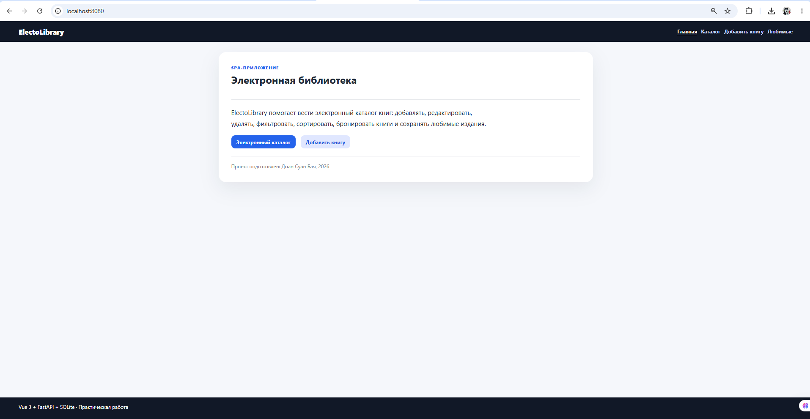
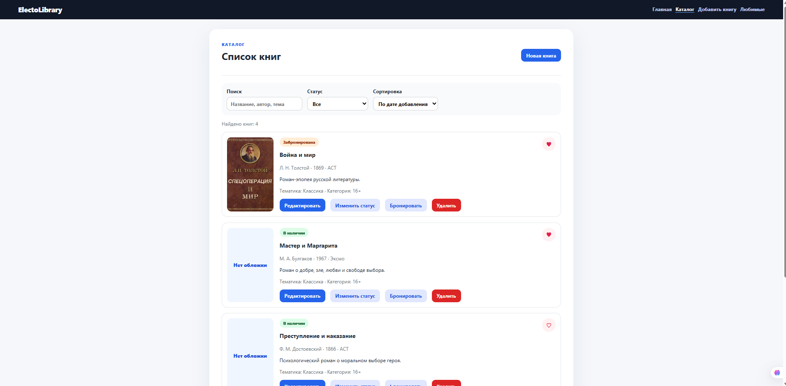
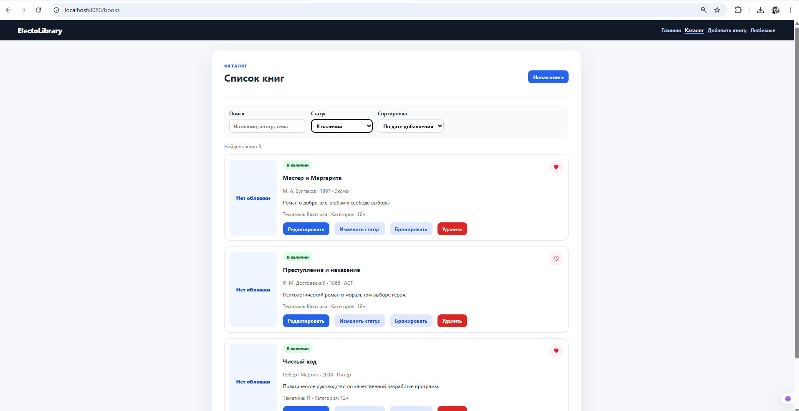
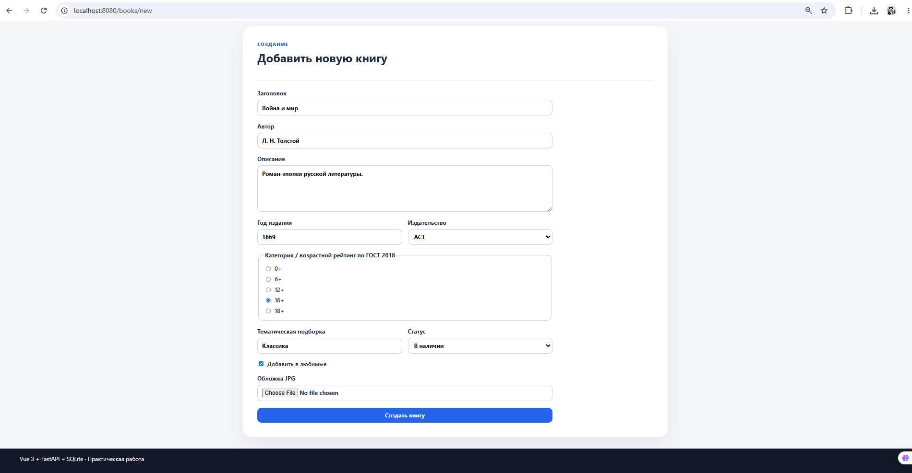
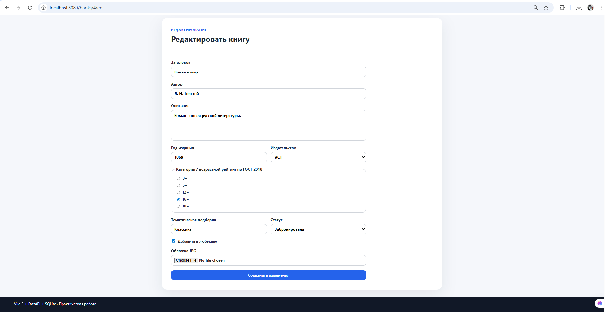
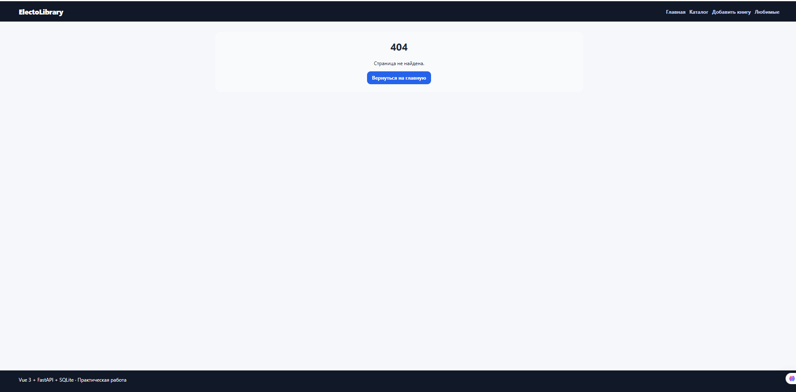

# Отчёт по практическому заданию

## 1. Титульная часть

**Автор:** Доан Суан Бач
**Группа:** P3269  
**Дата:** 06.06.2026  
**Название работы:** Разработка SPA-приложения на Vue 3 с сервером на Python  
**Проект:** ElectoLibrary — электронная библиотека  
**Ссылка на репозиторий:** https://github.com/DoanXuanBach/electolibrary-vue3.git

---

## 2. Цель работы

Целью работы является разработка полноценного SPA-приложения на Vue 3 с серверной частью на Python. В ходе выполнения задания были изучены привязка данных, события, `computed`, `watch`, формы, условный рендеринг, вывод массивов, компоненты, `props`, пользовательские события, слоты, маршрутизация Vue Router, работа с REST API, хранение данных в SQLite и запуск приложения через Docker.

---

## 3. Реализованный функционал

В проекте реализовано мини-приложение **ElectoLibrary** для работы с электронным каталогом книг.

### Компоненты

Созданы обязательные компоненты:

- `AppHeader.vue` — верхнее меню приложения;
- `AppFooter.vue` — нижняя панель;
- `LayoutCard.vue` — универсальная карточка со слотами;
- `BookList.vue` — список книг, фильтрация и сортировка;
- `BookItem.vue` — карточка одной книги;
- `BookForm.vue` — форма создания и редактирования книги.

### Работа с данными во Vue 3

В проекте используются:

- `v-for` для вывода списка книг;
- `v-if` для отображения пустого списка;
- `v-model.trim`, `v-model.number`, `v-model.lazy` в форме;
- `computed` для фильтрации и сортировки;
- `watch` для отслеживания изменения фильтров;
- `ref` и `onMounted` для фокусировки поля поиска после загрузки компонента;
- передача данных от родителя к дочернему компоненту через `props`;
- передача действий от дочернего компонента к родителю через `emit`.

### Слоты

В компоненте `LayoutCard.vue` используются:

- обычный слот для основного содержимого;
- именованный слот `header`;
- именованный слот `footer`;
- слот с ограниченной областью видимости, который передаёт `createdBy` и `year`.

### Маршрутизация

Настроен Vue Router:

- `/` — главная страница;
- `/books` — каталог книг;
- `/books/new` — создание книги;
- `/books/:id/edit` — редактирование книги;
- `/books/favorites` — список любимых книг;
- `/:pathMatch(.*)*` — страница 404.

Также используются вложенные маршруты, именованные маршруты и программная навигация через `router.push()`.

### Серверная часть

Сервер реализован на FastAPI. Данные сохраняются в SQLite-файл `data/tasks.db`. При старте приложения база данных создаётся автоматически, если её ещё нет. Также добавляются тестовые книги.

Реализованы CRUD-методы:

```text
GET /api/books
GET /api/books/{id}
GET /api/boooks/{id}
POST /api/books
PUT /api/books/{id}
DELETE /api/books/{id}
```

Дополнительно реализована загрузка JPG-обложки книги в папку `backend/uploads`.

---

## 4. Скриншоты интерфейса
1. Главная страница `/`.
### Главная страница


2. Страница списка книг `/books`.
### Список книг


3. Фильтрация и сортировка книг.
### Фильтрация и сортировка



4. Форма создания книги `/books/new`.
### Форма создания книги


5. Форма редактирования `/books/:id/edit`.
### Форма редактирования книги


6. Страница 404.
### Страница 404



---

## 5. Примеры кода

### Пример вывода списка книг

```vue
<BookItem
  v-for="book in sortedBooks"
  :key="book.id"
  :book="book"
  @delete="emit('delete', $event)"
  @toggle-status="emit('toggle-status', $event)"
  @toggle-favorite="emit('toggle-favorite', $event)"
  @reserve="emit('reserve', $event)"
  @edit="emit('edit', $event)"
/>
```

### Пример computed-свойства

```js
const sortedBooks = computed(() => {
  const items = [...filteredBooks.value]
  if (sortMode.value === 'title_asc') {
    return items.sort((a, b) => a.title.localeCompare(b.title, 'ru'))
  }
  return items.sort((a, b) => new Date(b.created_at) - new Date(a.created_at))
})
```

### Пример слота

```vue
<LayoutCard>
  <template #header>
    <h1>Электронная библиотека</h1>
  </template>

  <p>Основное содержимое страницы</p>

  <template #footer="slotProps">
    <span>Проект подготовлен: {{ slotProps.createdBy }}</span>
  </template>
</LayoutCard>
```

### Пример API-метода FastAPI

```python
@app.get("/api/books", response_model=list[Book])
def get_books() -> list[Book]:
    with get_connection() as connection:
        rows = connection.execute("SELECT * FROM books ORDER BY created_at DESC").fetchall()
        return [row_to_book(row) for row in rows]
```

---

## 6. JSON / SQLite данные

Пример объекта книги, который хранится в SQLite:

```json
{
  "id": 1,
  "title": "Мастер и Маргарита",
  "author": "М. А. Булгаков",
  "description": "Роман о добре, зле, любви и свободе выбора.",
  "year": 1967,
  "publisher": "Эксмо",
  "category": "16+",
  "theme": "Классика",
  "status": "available",
  "favorite": true,
  "cover_url": null,
  "created_at": "2026-06-06T00:00:00+00:00",
  "updated_at": "2026-06-06T00:00:00+00:00"
}
```

База данных находится в файле:

```text
data/tasks.db
```

Файл создаётся автоматически после первого запуска backend-контейнера.

---

## 7. Инструкция по запуску Docker

Для запуска проекта нужно выполнить команды из корня репозитория:

```bash
docker compose build
docker compose up
```

После запуска приложение доступно по адресам:

```text
Frontend: http://localhost:8080
Backend API: http://localhost:8000/api/books
Swagger: http://localhost:8000/docs
```

---

## 8. Выводы

В результате выполнения работы было создано SPA-приложение на Vue 3 с серверной частью на Python FastAPI. В проекте были использованы компоненты, маршрутизация, формы, `props`, события, слоты, `computed`, `watch`, работа с REST API и хранение данных в SQLite. Также был подготовлен запуск проекта через Docker Compose, что позволяет быстро поднять frontend и backend в отдельных контейнерах.
